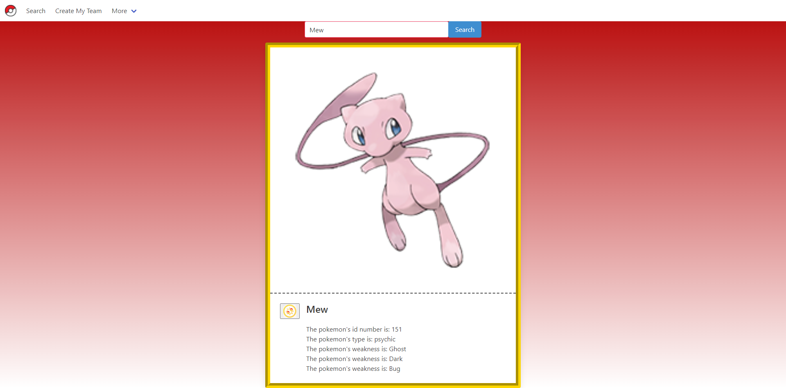

# Project1

David Schepis

Hamin Kim

Alix Borja

Jules O'Neale

Github: https://github.com/davidschepis/Project1

Live page: https://davidschepis.github.io/Project1/

APIs Used

https://rapidapi.com/lduran2@gmail.com/api/pokedex2/

https://rapidapi.com/alextrisner@gmail.com/api/dice-roll/

Concept: Website allow users to search for a pokemon, which will call the pokedex API and return the pokemon's data. A battle button will appear
which will go to another webpage and allow the user to battle a random pokemon. Seperate pages allows a user to see pokemons wins and losses and
create a random team of 6 pokemon.

CSS Alternative: https://bulma.io/

Screenshots

